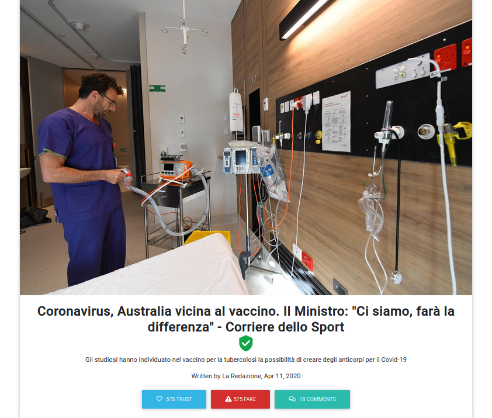

# Kubernetes-App

  
  

##  📋 Introduction
- As part of our participation in the 'HET_S7I7 HACK' organised by HACK-UP. We built a MEAN-STACK platform in order to catch fake news and avoir not reliable sources, This intelligent system is base on users interaction (trust , not trust) on every shared news in fact this kind of operations will balance the pourcentage of credibility for each user (Simple users,  sources ) . 

## 🎉 Technologies and features  

- Angular 8 .
- Nodejs . 
- MongoDB. 
- ExpressJS . 
- Real time News . 
- Social Media. 
- POST / Comments / Like / Dislike  . 
- Animate.js

##  Project Road-Map 
-> https://drive.google.com/drive/u/0/folders/1DpLq0n33_os8zl8E3KiFtC7KVPY119Bj

## Video Presentation 
-> https://drive.google.com/drive/u/0/folders/1DpLq0n33_os8zl8E3KiFtC7KVPY119Bj

## Project BMC
-> https://drive.google.com/drive/u/0/folders/1DpLq0n33_os8zl8E3KiFtC7KVPY119Bj
